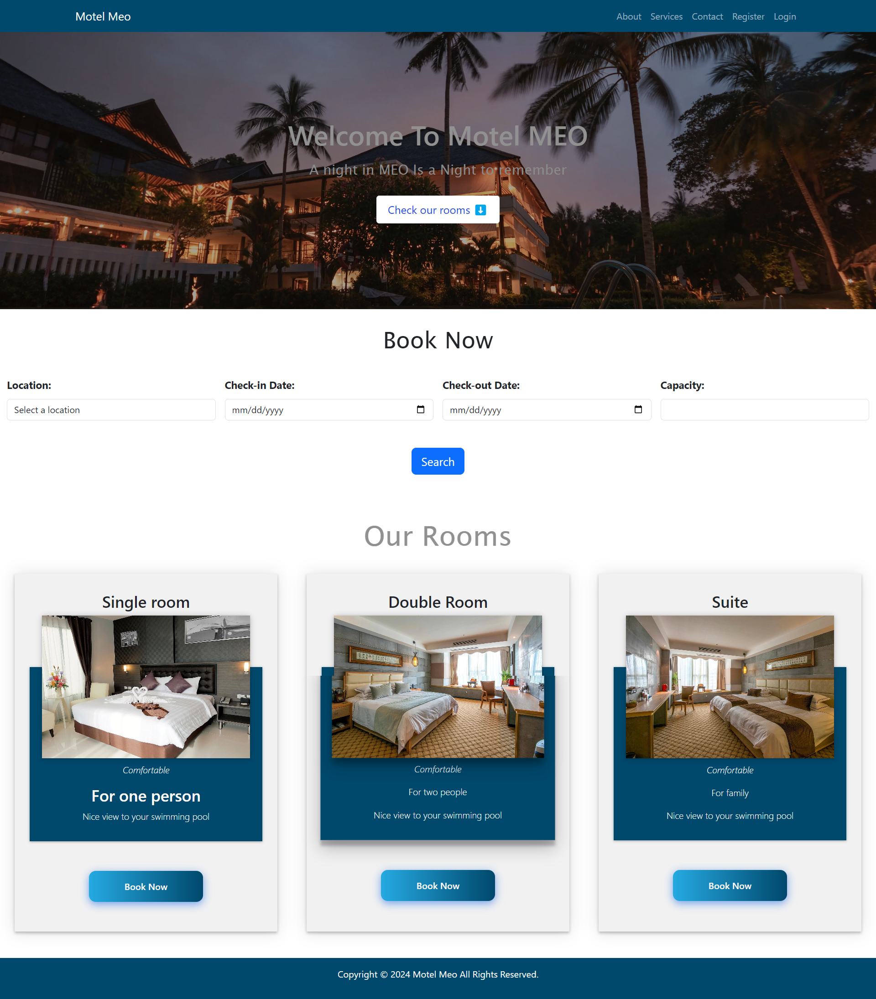

# Motel Meo

**Motel Meo: A Django-powered web application for seamless hotel management and booking**


- [Live Site](https://motel-meo-2bd41eb1b83a.herokuapp.com/)
- [GitHub Repo](https://github.com/wlia-code/Motel-Meo)

## Table of Contents

- [Project Description](#project-description)
- [Features](#features)
  - [Hotel Management](#hotel-management)
  - [Room Management](#room-management)
  - [Booking System](#booking-system)
- [Visual Overview](#visual-overview) *(Screenshots)*
- [Strategy](#strategy)
- [Installation & Usage](#installation--usage)
- [Testing](#testing)
- [Bugs Found and Fixed](#bugs-found-and-fixed)
- [Built With](#built-with) 
- [Deployment](#deployment)
- [Credits](#credits)
- [Acknowledgments](#acknowledgments)

## Project Description

**Motel-Meo** is a comprehensive hotel management system designed for seamless management of hotel operations. This web-based application offers a robust suite of features to manage hotel accommodations, including room bookings, availability checks, and customer management.

## Features

### Hotel Management

Manage multiple hotels, each with details such as name, location, and available accommodations

### Room Management

Each hotel can list several types of rooms, specifying details like room type (e.g., Single, Double, Suite, Triple), availability, price, capacity, and size.

### Booking System

Customers can book rooms based on their preferences, with features such as selecting check-in and check-out dates, viewing room types, and confirming bookings instantly

[Back to Top](#Table-of-Contents)

## Overview

Motel Meo provides a comprehensive and user-friendly platform for motel booking and management. Below are key screenshots that illustrate the functionality and design of the application.

### Home Page


The home page welcomes users with a clean and intuitive interface, providing easy navigation to all major sections of the website.


### About Us


This page gives an overview of Motel Meo, including our mission, vision, and values.

### Services


Details the range of services offered by Motel Meo, enhancing the stay experience for guests.

### Search Bar


Allows users to quickly find available motels based on location, date, and other preferences.

### Search Results


Displays the motels that match the user's search criteria, complete with pricing and availability details.

### Booking Confirmation


Confirms a user’s reservation with all relevant details, ensuring clarity and ease of use.

### My Bookings


Users can view all their bookings, manage them, and access past booking history.

### Edit Booking


Provides users with the ability to modify their existing bookings.

### Delete Confirmation


A confirmation screen that ensures users are certain about deleting a booking.

### Sign In


Secure login page for returning users.

### Sign Up


Registration page for new users to create an account.

### Contact Us


Contains contact information and a form for users to send inquiries or feedback.

### Success Message


Displayed after a user successfully submits the contact form, confirming that their message has been sent.

**This visual guide provides a quick overview of the key functionalities and design elements of Motel Meo. Each component is crafted to ensure a seamless and enjoyable experience for our users.** 

[Back to Top](#Table-of-Contents)

## Strategy

The Motel Meo project aims to create a web application for booking and managing motel rooms, enhancing operational efficiency and user engagement for motel owners. It leverages Django, Python, HTML/CSS, and JavaScript to deliver a robust UI/UX.

### Objectives

- **Project Setup**
  - Initialize Django project and applications with a structured directory.
  - Define database models for motel operations and integrate custom CSS & JavaScript.
  - Develop a `base.html` for consistent layouts and integrate Google Fonts.

- **User Experience (UX)**
  - Customize UI elements like favicon, static file management with Whitenoise, and styled authentication pages using allauth.
  - Design an engaging homepage, implement a functional contact form, and notifications for user interactions.

- **Navigation**
  - Ensure consistent navigation with a Navbar and styled Footer across all pages.

- **CRUD Functionality**
  - Facilitate room bookings, viewing, updating, and cancellation through user-friendly interfaces.
  - Enhance admin capabilities for comprehensive room and booking management.

- **Authentication**
  - Implement Django allauth for secure user registration, authentication, and account management.

- **Validation**
  - Ensure booking form validations for data accuracy and availability.

- **Administration**
  - Equip admins with detailed features for managing bookings and room details comprehensively.

- **Deployment**
  - Deploy using Heroku, ensuring a production-ready setup with Cloudinary for file management.

- **Testing**
  - Develop and conduct unit and manual testing to validate functionality and user journeys.

- **Documentation**
  - Maintain detailed documentation in README.md for guiding ongoing and future development.


      [Back to Top](#Table-of-Contents)
## Installation & Usage

### Prerequisites

Ensure that you have Python (version 3.7 or newer) installed on your system. If not, download and install it from [python.org](https://www.python.org/downloads/).

### Installing

### Setup
1. Clone the project repository:
   ```bash
   $ git clone https://github.com/yourusername/motel-meo.git

2. Navigate into the project directory:
   ```bash
    $ cd motel-meo

3. Install dependencies:
   ```bash
    $ pip install -r requirements.txt

- Create a env.py file and add the Environment Variables:
  - DATABASE_URL
  - SECRET_KEY
  - CLOUDINARY_URL
  - EMAIL_USER
  - EMAIL_PASSWORD
- Create a .gitignore file And add the following files to it:
  - env.py
  - venv

### Running the Application

1. Start the development server
   ```bash
    $ python manage.py runserver

1. Apply database migrations (create tables based on your models)
   ```bash
    $ python manage.py makemigrations
    $ python manage.py migrate

[Back to Top](#Table-of-Contents)

## Testing

### Python Test

- File can be found at `Motel_Meo/test.py`

  - Running the Test using This Command:**
    ```bash
    $ python manage.py test

### Motel Meo was tested on the following browsers: 

  - Google Chrome
  - Mozilla Firefox
  - Microsoft Edge
  - Apple Safari

### Validator Testing:

- Accessibility Testing

  - No errors were returned when passing through [WAVE Evaluation Tool](https://wave.webaim.org/)

  - Accessibility second Testing Using chrome lighthouse 

- Codeinstitute Python Linter
  - No errors were returned when passing through codeinstitute Python Linter [CI Python Linter](https://pep8ci.herokuapp.com/)

- JAVASCRIPT
  - No errors were returned when passing through the official [jshint](https://jshint.com/)
- HTML
  - No errors were returned when passing through the official [W3C validator](https://validator.w3.org/nu/#textarea)
- CSS
  - No errors were found when passing through the official [(Jigsaw) validator](https://jigsaw.w3.org/css-validator/validator)


[Back to Top](#Table-of-Contents)

## Built With

Motel Meo was built using a combination of industry-standard technologies and tools:

**Core Technologies:**

* **Django:** A high-level Python web framework used for the backend logic and structure of the application.
* **Python:** The primary programming language used throughout the project for its readability and robust web development capabilities.
* **HTML:**  Used to define the structure and content of the web pages.
* **CSS:**  Used for styling the visual presentation of the website.
* **JavaScript:**  Used for adding interactivity and dynamic elements to the web pages. 

**Additional Libraries & Frameworks:**

* **Django Allauth:** Simplifies user authentication and registration processes.
* **Whitenoise:**  Efficiently serves static files in production environments.
* **Bootstrap 5:**  Provides a responsive grid system and pre-styled UI components.
* **Font Awesome:**  Offers a wide range of icons for visual enhancements.

**Other Tools & Services:**

* **ElephantSQL:** Cloud-based PostgreSQL database for data storage and management.
* **Heroku:** Platform for deploying and hosting the application.
* **Git:** Version control system for tracking code changes.
* **GitHub:**  Web-based hosting service for version control using Git.
* **Cloudinary:**  Cloud-based media management service for storing and delivering images and other media assets.

[Back to Top](#Table-of-Contents)

## Bugs Found and Fixed

### Bug Fixes

#### 1. Static Files Not Updating in Production
- **Issue**: Changes to `style.css` were not reflecting in the production environment.
- **Root Cause**: Misconfiguration in the handling of static files between development (`DEBUG = True`) and production (`DEBUG = False`).
- **Solution**: Implemented WhiteNoise to serve static files efficiently in production. Configured `STATICFILES_STORAGE` to use `whitenoise.storage.CompressedManifestStaticFilesStorage` and ensured correct settings in `STATIC_ROOT` and `STATICFILES_DIRS`.
- **Outcome**: Static files now update correctly in both development and production environments.

#### 2. Conflicting Static Files Storage Settings
- **Issue**: The project had conflicting settings for `STATICFILES_STORAGE` which caused confusion in static file handling.
- **Root Cause**: `STATICFILES_STORAGE` was set to both `cloudinary_storage.storage.StaticHashedCloudinaryStorage` and `whitenoise.storage.CompressedManifestStaticFilesStorage` in the settings.
- **Solution**: After evaluating both options, we decided to use WhiteNoise for its simplicity and efficiency in serving static files directly from the server. Removed the Cloudinary storage setting.
- **Outcome**: Simplified the static file handling and removed the dependency on external services for serving static files.

### 3. duplicated Files in Git Repository:
- **The duplicate files were removed from the Git repository using the command:**
    ```bash
    git rm --cached img
    ```

### Ongoing Issues

- **Current Bugs**: No critical bugs are currently impacting production. Minor UI adjustments are in progress.
- **Monitoring**: Continuously monitoring the application performance and user feedback to identify and fix any emerging issues promptly.

### Conclusion

The above fixes have significantly improved the stability and performance of our application. I committed to maintaining a high standard of quality and responsiveness in addressing any future issues that may arise.

[Back to Top](#Table-of-Contents)

## Deployment

### ElephantSQL

1. Log into [ElephantSQL](https://customer.elephantsql.com/login).
2. Create a new instance by selecting the _Tiny Turtle_ plan and your local region.
3. After creation, from the dashboard, click on the instance name and copy the _Database URL_ for Heroku configuration.

### Cloudinary

1. Log into [Cloudinary](https://cloudinary.com).
2. From the dashboard, copy the _API Environment variable_ for Heroku configuration.

### Heroku

1. Log into [Heroku](https://www.heroku.com/) and create a new app.
2. In the _Settings_ tab, add the following config vars:
   - `CLOUDINARY_URL` (from Cloudinary)
   - `DATABASE_URL` (from ElephantSQL)
   - `SECRET_KEY`
   - `PORT`
   - `EMAIL_PASSWORD` (from your email provider)
3. In the _Resources_ tab, attach the Heroku Postgres service.
4. In the _Deploy_ tab, connect to GitHub, select your repository, and set up automatic deployments from the main branch.
5. Optionally, perform a manual deploy to build the app.

[Back to Top](#Table-of-Contents)

## Credits

### Content

- The icons in the serves page sourced from [Font Awesome](https://fontawesome.com).
- All fonts were sourced from [Google Fonts](https://fonts.google.com).
- Responsive design and components were implemented using [Bootstrap](https://getbootstrap.com).
- User authentication was managed with [Django Allauth](https://django-allauth.readthedocs.io/en/latest/).

### Media

- Images were sourced from [Unsplash](https://unsplash.com), providing high-resolution photographs for the website.
- Emojis were sourced from [Get Emoji](https://getemoji.com/).

### Github Template

- The project template was provided by the [Code Institute Template](https://github.com/Code-Institute-Org/gitpod-full-template).

### Tools To Build README File

- Website screenshots were captured using the [GoFullPage - Full Page Screen Capture](https://chrome.google.com/webstore/detail/gofullpage-full-page-scre/fdpohaocaechififmbbbbbknoalclacl) extension.
- The README file was crafted using [readme.so](https://readme.so/).

### Development Tools

Motel Meo was developed using a variety of tools to ensure high-quality development and user experience:

- [GitHub](https://github.com/) for hosting and version control.
- [VS Code](https://code.visualstudio.com/) as the primary code editor.
- [Heroku](https://dashboard.heroku.com/) for application deployment.
- [ElephantSQL](https://www.elephantsql.com/) for database management.
- [Balsamiq](https://balsamiq.com/wireframes/) for wireframe creation.
- [Favicon.io](https://favicon.io/) for favicon generation.
- [Bootstrap5](https://getbootstrap.com/) and [Google Fonts](https://fonts.google.com/) for styling.
- [Code Institute Pylint](https://pep8ci.herokuapp.com/), [W3C HTML Validator](https://validator.w3.org/#validate_by_uri+with_options), and [Jigsaw CSS Validator](https://jigsaw.w3.org/css-validator/#validate_by_uri) for code validation.
- [Chrome Dev Tools](https://developer.chrome.com/docs/devtools/), [W.A.V.E.](https://wave.webaim.org/), and [Chrome LightHouse extension](https://developer.chrome.com/docs/lighthouse/overview/) for testing and optimization.
- [Cloudinary](https://cloudinary.com/) for media management.

These tools collectively enhance the efficiency, reliability, and scalability of the Motel Meo project.

[Back to Top](#Table-of-Contents)

## Acknowledgements

I would like to express my gratitude to several key individuals who have supported me throughout the development of Motel Meo.

### Mentorship
- **Victor Miclovich**: thanks to Victor for his invaluable guidance and mentorship.
### Support
- **Code Institute Student Care**: A special thank you to the Student Care team at [Code Institute](https://codeinstitute.net).

[Back to Top](#Table-of-Contents)
